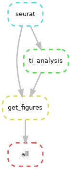

# BAT

Repository contains workflow which was implemented for BAT scRNA-seq data analysis.

## Pipeline
There are 2 conceptual parts of the pipeline:

* **Downstream analysis**: cell ranger filtered matrixes were used as input files 
    * Seurat, SCT: https://genomebiology.biomedcentral.com/articles/10.1186/s13059-019-1874-1
    * Seurat, integration: https://www.cell.com/cell/fulltext/S0092-8674(19)30559-8

* **Trajectory inference**: macrophage clusters isolated from downstream analysis output were used as input
    * Article: https://www.nature.com/articles/s41587-019-0071-9
    * Quick start: https://dynverse.org/users/2-quick_start/
    * Methods: https://dynverse.org/reference/dynmethods/

## Scheme



## Execution

Before execution, set your pathes in `config.yaml` directory and make sure that all required packages were installed.

```{commandline}
snakemake -j 1
```
